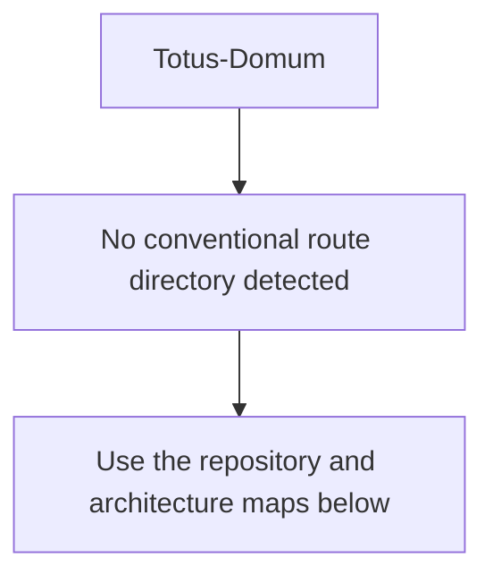
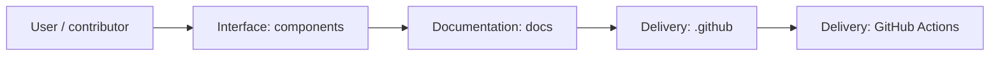
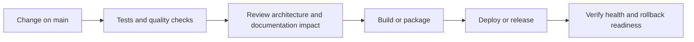
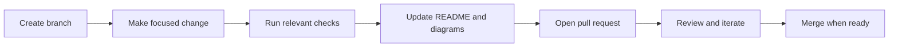
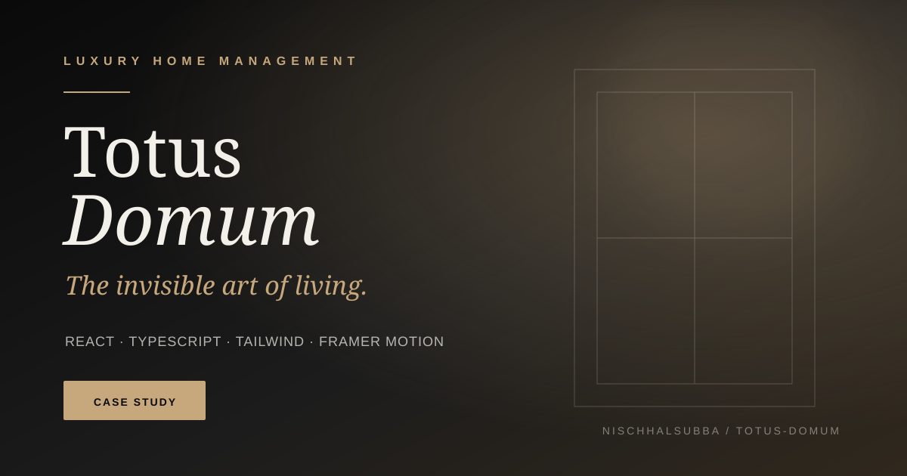

<!-- interactive-readme-standard:start -->

<div align="center">

# Totus-Domum

**Branch-aware technical guide for [`main`](https://github.com/Nischhalsubba/Totus-Domum/tree/main)**

<p>       </p>

<p>
  <a href="https://github.com/Nischhalsubba/Totus-Domum/tree/main"><strong>Browse source</strong></a> ·
  <a href="https://github.com/Nischhalsubba/Totus-Domum/issues"><strong>Issues</strong></a> ·
  <a href="https://github.com/Nischhalsubba/Totus-Domum/codespaces/new?ref=main"><strong>Open in Codespaces</strong></a>
</p>

</div>

> [!IMPORTANT]
> This guide is generated from the files actually present on `main`. It links to detected source paths, preserves project-authored notes, and avoids claiming components that were not found.

## At a glance

| Item | Detected value |
|---|---|
| Purpose | A React project documented from the current branch structure and manifests. |
| Branch role | Default branch |
| Stack | React, Vite, Tailwind CSS, TypeScript, JavaScript, HTML, CSS |
| Manifests | package.json |
| Prerequisites | Node.js |
| Delivery | GitHub Actions |
| License | No license file detected |

## Branch scope

This is the repository's default branch.


## Quick start

```bash
npm install
npm run dev
npm run build
npm run typecheck
npm run preview
```

### Configuration surface

- No committed environment example file was detected.

> Never commit secrets, private keys, production credentials, customer data, or unredacted infrastructure details.

## Repository map

```mermaid
flowchart TD
    ROOT["Totus-Domum / main"]
    ROOT --> P0[".github/"]
    ROOT --> P1["components/"]
    ROOT --> P2["docs/"]
    ROOT --> P3[".gitignore"]
    ROOT --> P4["AGENTS.md"]
    ROOT --> P5["App.tsx"]
    ROOT --> P6["constants.ts"]
    ROOT --> P7["index.css"]
    ROOT --> P8["index.html"]
    ROOT --> P9["index.tsx"]
    ROOT --> P10["metadata.json"]
    ROOT --> P11["package.json"]
    ROOT --> P12["postcss.config.js"]
    ROOT --> P13["script.js"]
    ROOT --> P14["tailwind.config.js"]
    ROOT --> P15["tsconfig.json"]
    ROOT --> P16["vite.config.ts"]
```



| Responsibility | Detected source paths |
|---|---|
| Interface | [`components`](https://github.com/Nischhalsubba/Totus-Domum/tree/main/components) |
| Documentation | [`docs`](https://github.com/Nischhalsubba/Totus-Domum/tree/main/docs) |
| Delivery | [`.github`](https://github.com/Nischhalsubba/Totus-Domum/tree/main/.github) |

## Website or application map



## Architecture and responsibility flow




## Quality, security, and operations

<table>
<tr>
<td width="33%" valign="top">

### Quality

- No conventional test directory was detected automatically.

Detected commands:
- `npm run dev`
- `npm run build`
- `npm run typecheck`
- `npm run preview`

</td>
<td width="33%" valign="top">

### Security

- No dedicated security policy or automated dependency configuration was detected.

Review authentication, authorization, input validation, dependency updates, secret handling, and failure recovery before release.

</td>
<td width="34%" valign="top">

### Observability

- No dedicated observability integration was detected automatically.

Define useful logs, metrics, traces, alerts, and rollback signals for production-facing branches.

</td>
</tr>
</table>

## Delivery flow



### Automation detected

- [`.github/workflows/apply-interactive-readme.yml`](https://github.com/Nischhalsubba/Totus-Domum/blob/main/.github/workflows/apply-interactive-readme.yml)

## Contribution flow



- Keep changes focused and explain architectural consequences.
- Run the checks relevant to the changed area.
- Update diagrams whenever routes, modules, data models, authentication, jobs, or delivery paths change.
- Add screenshots or recordings for visual behavior changes when useful.
- Use issues for reproducible defects and pull requests for reviewable changes.

## Ownership and support

| Topic | Source |
|---|---|
| Repository | [`Nischhalsubba/Totus-Domum`](https://github.com/Nischhalsubba/Totus-Domum) |
| Branch | [`main`](https://github.com/Nischhalsubba/Totus-Domum/tree/main) |
| Ownership | No CODEOWNERS file detected |
| Contributing | Use the contribution flow above |
| Support | [Open or review issues](https://github.com/Nischhalsubba/Totus-Domum/issues) |
| License | No license file detected |

<details>
<summary><strong>Documentation maintenance checklist</strong></summary>

- [ ] Purpose and branch scope are accurate.
- [ ] Setup and configuration commands still work.
- [ ] Repository, application, API, data, authentication, job, and deployment diagrams match the code.
- [ ] Tests, security controls, observability, and rollback behavior are documented.
- [ ] Links point to real files on this branch.
- [ ] No secrets or private operational details are exposed.

</details>

<!-- interactive-readme-standard:end -->

<!-- project-authored-notes:start -->
<details>
<summary><strong>Project-authored notes preserved from this branch</strong></summary>

<div align="center">



# Totus Domum

### The invisible art of living

A premium editorial landing page for a Malta-focused luxury home-management and lifestyle-support concept.


[Live site](https://nischhalsubba.github.io/Totus-Domum/) · [Engineering case study](./docs/PRODUCT_AND_ENGINEERING_CASE_STUDY.md)


</div>

## Product

Totus Domum presents discreet residence management, lifestyle support, and property-search services for affluent residents in Malta. The interface uses an editorial luxury system built around deep black, warm alabaster, muted gold, serif typography, generous spacing, and controlled motion.

## Experience highlights

- full-screen parallax hero with the positioning line **The Invisible Art of Living**
- timed preloader and custom cursor
- animated navigation and scroll guidance
- horizontally scrolling service cards
- residence management, lifestyle support, and property-search content
- parallax feature story with a glass-like editorial panel
- animated watermark section based on the client concept
- contact area with floating labels and service selection
- responsive Tailwind layout and GitHub Pages deployment

## Architecture

```text
index.tsx
  └── App.tsx
      ├── Preloader
      ├── CustomCursor
      ├── Navigation
      ├── Hero
      ├── IntroSection
      ├── Services
      ├── FeatureSection
      ├── WatermarkSection
      ├── ContactForm
      └── Footer
```

The app is intentionally component-driven. `App.tsx` owns the loading state and section order, `constants.ts` stores the service data, Tailwind defines the brand system, and Framer Motion provides entrance, scroll, hover, and parallax behavior.

## Current implementation status

| Area | Status |
|---|---|
| Editorial landing page | Implemented |
| Responsive section layout | Implemented |
| Motion and parallax | Implemented |
| Service presentation | Implemented |
| GitHub Pages scripts | Configured |
| Contact form submission | Visual only |
| Form validation | Not implemented |
| CMS or admin system | Not implemented |
| Automated tests | Not present |
| Local browser screenshot | Not captured in this pass |

The repository thumbnail is a branded design asset derived from the source design system. It is not presented as a runtime screenshot. A real screenshot should replace or supplement it after the deployed site is manually verified.

## Technology

| Layer | Technology |
|---|---|
| UI | React 18 |
| Language | TypeScript |
| Build | Vite 5 |
| Styling | Tailwind CSS 3.4 |
| Motion | Framer Motion 11 |
| Icons | Lucide React |
| Hosting | GitHub Pages via `gh-pages` |

## Run locally

```bash
npm install
npm run dev
```

Production verification:

```bash
npm run check
npm run preview
```

The package requires Node.js 22 or newer and npm 10 or newer.

## Deployment

```bash
npm run deploy
```

The deployment script builds the application and publishes `dist/` to GitHub Pages.

## Important limitations

- The contact form button uses `type="button"`; it does not submit data.
- The service cards and primary calls to action are presentation elements unless handlers are added.
- The app depends on externally hosted Unsplash and Picsum images.
- The preloader delays access to content for about 2.8 seconds on every mount.
- The custom cursor must be tested carefully for touch devices and accessibility.
- A browser launch could not be performed from the current execution environment because outbound GitHub cloning was unavailable.

## Documentation

- [Product and engineering case study](./docs/PRODUCT_AND_ENGINEERING_CASE_STUDY.md)
- [Repository instructions](./AGENTS.md)
- [Repository thumbnail](./docs/assets/totus-domum-repository-thumbnail.svg)

## Author

Designed and maintained by [Nischhal Raj Subba](https://github.com/Nischhalsubba).

</details>
<!-- project-authored-notes:end -->
