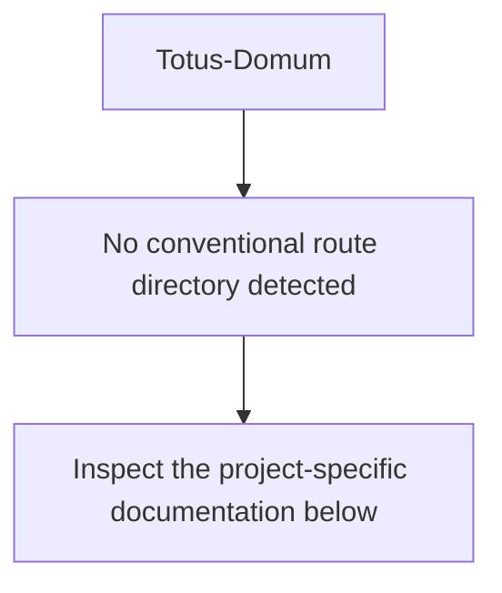
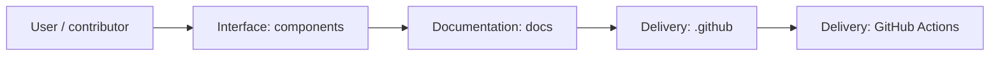
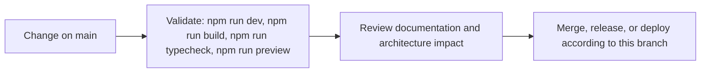

```mermaid
flowchart TD
    ROOT["Totus-Domum / main"]
    ROOT --> P0[".github/"]
    ROOT --> P1["components/"]
    ROOT --> P2["docs/"]
    ROOT --> P3[".gitignore"]
    ROOT --> P4["AGENTS.md"]
    ROOT --> P5["App.tsx"]
    ROOT --> P6["constants.ts"]
    ROOT --> P7["index.css"]
    ROOT --> P8["index.html"]
    ROOT --> P9["index.tsx"]
    ROOT --> P10["metadata.json"]
    ROOT --> P11["package.json"]
    ROOT --> P12["postcss.config.js"]
    ROOT --> P13["script.js"]
    ROOT --> P14["tailwind.config.js"]
    ROOT --> P15["tsconfig.json"]
    ROOT --> P16["vite.config.ts"]
```

<div align="center">


# Totus Domum

<!-- interactive-readme-standard:start -->

> [!NOTE]
> **Branch-specific documentation:** this section is maintained for [`main`](https://github.com/Nischhalsubba/Totus-Domum/tree/main). It is generated from the files present on this branch and preserves the project-authored README below.

<details open>
<summary><strong>Interactive repository guide</strong></summary>

## Branch overview

| Item | Value |
|---|---|
| Repository | [`Nischhalsubba/Totus-Domum`](https://github.com/Nischhalsubba/Totus-Domum) |
| Branch | [`main`](https://github.com/Nischhalsubba/Totus-Domum/tree/main) |
| Detected stack | React, Vite, Tailwind CSS, TypeScript, JavaScript, HTML, CSS |
| Detected manifests | package.json |
| Documentation policy | Every maintained branch must explain purpose, setup, structure, architecture, flows, testing, delivery, security, and ownership. |

## Repository structure



The diagram is generated from the branch's actual top-level files and directories. Use the branch link above for complete source navigation.

## Website or application structure



## Application and responsibility flow



## Change-to-delivery flow



## README requirements for this branch

- Explain what this branch contains and how it differs from the default branch.
- Keep installation, configuration, usage, testing, deployment, security, support, and license information accurate.
- Document repository, website or application, API, data, authentication, background-job, and deployment flows when they exist.
- Prefer Mermaid diagrams and expandable `<details>` sections for visual navigation.
- Link diagrams and modules to real source paths; never invent missing components.
- Preserve project-specific documentation and update diagrams whenever architecture or major paths change.
- Treat secrets, private infrastructure, customer data, and credentials as prohibited README content.

</details>

<!-- interactive-readme-standard:end -->

### The invisible art of living

A premium editorial landing page for a Malta-focused luxury home-management and lifestyle-support concept.


[Live site](https://nischhalsubba.github.io/Totus-Domum/) · [Engineering case study](./docs/PRODUCT_AND_ENGINEERING_CASE_STUDY.md)


</div>

## Product

Totus Domum presents discreet residence management, lifestyle support, and property-search services for affluent residents in Malta. The interface uses an editorial luxury system built around deep black, warm alabaster, muted gold, serif typography, generous spacing, and controlled motion.

## Experience highlights

- full-screen parallax hero with the positioning line **The Invisible Art of Living**
- timed preloader and custom cursor
- animated navigation and scroll guidance
- horizontally scrolling service cards
- residence management, lifestyle support, and property-search content
- parallax feature story with a glass-like editorial panel
- animated watermark section based on the client concept
- contact area with floating labels and service selection
- responsive Tailwind layout and GitHub Pages deployment

## Architecture

```text
index.tsx
  └── App.tsx
      ├── Preloader
      ├── CustomCursor
      ├── Navigation
      ├── Hero
      ├── IntroSection
      ├── Services
      ├── FeatureSection
      ├── WatermarkSection
      ├── ContactForm
      └── Footer
```

The app is intentionally component-driven. `App.tsx` owns the loading state and section order, `constants.ts` stores the service data, Tailwind defines the brand system, and Framer Motion provides entrance, scroll, hover, and parallax behavior.

## Current implementation status

| Area | Status |
|---|---|
| Editorial landing page | Implemented |
| Responsive section layout | Implemented |
| Motion and parallax | Implemented |
| Service presentation | Implemented |
| GitHub Pages scripts | Configured |
| Contact form submission | Visual only |
| Form validation | Not implemented |
| CMS or admin system | Not implemented |
| Automated tests | Not present |
| Local browser screenshot | Not captured in this pass |

The repository thumbnail is a branded design asset derived from the source design system. It is not presented as a runtime screenshot. A real screenshot should replace or supplement it after the deployed site is manually verified.

## Technology

| Layer | Technology |
|---|---|
| UI | React 18 |
| Language | TypeScript |
| Build | Vite 5 |
| Styling | Tailwind CSS 3.4 |
| Motion | Framer Motion 11 |
| Icons | Lucide React |
| Hosting | GitHub Pages via `gh-pages` |

## Run locally

```bash
npm install
npm run dev
```

Production verification:

```bash
npm run check
npm run preview
```

The package requires Node.js 22 or newer and npm 10 or newer.

## Deployment

```bash
npm run deploy
```

The deployment script builds the application and publishes `dist/` to GitHub Pages.

## Important limitations

- The contact form button uses `type="button"`; it does not submit data.
- The service cards and primary calls to action are presentation elements unless handlers are added.
- The app depends on externally hosted Unsplash and Picsum images.
- The preloader delays access to content for about 2.8 seconds on every mount.
- The custom cursor must be tested carefully for touch devices and accessibility.
- A browser launch could not be performed from the current execution environment because outbound GitHub cloning was unavailable.

## Documentation

- [Product and engineering case study](./docs/PRODUCT_AND_ENGINEERING_CASE_STUDY.md)
- [Repository instructions](./AGENTS.md)
- [Repository thumbnail](./docs/assets/totus-domum-repository-thumbnail.svg)

## Author

Designed and maintained by [Nischhal Raj Subba](https://github.com/Nischhalsubba).
